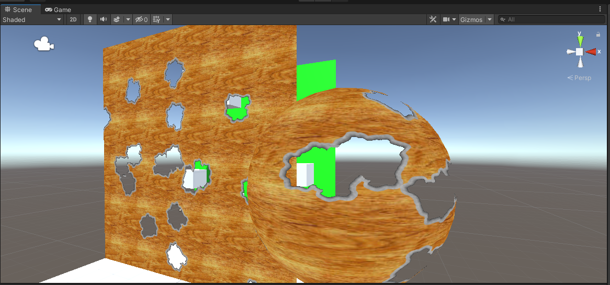
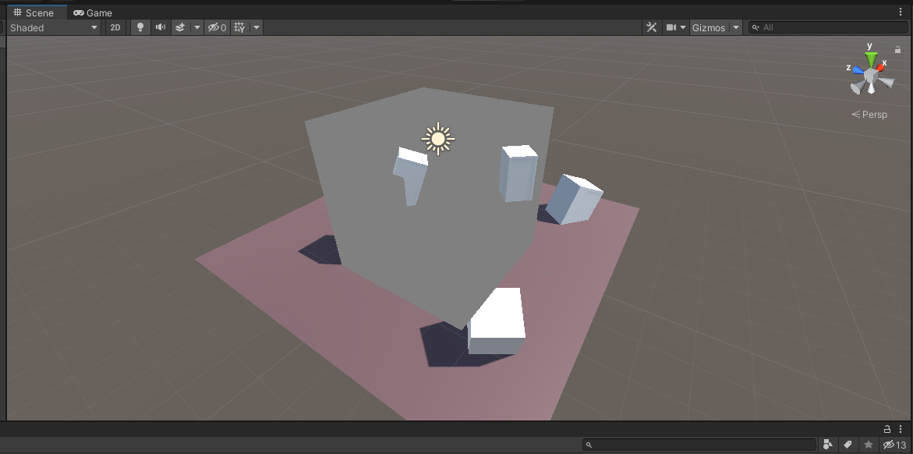

# unity-shaders-study

A study shader project.

 
 

  

<h3 align="center">
  Water
</h3>

 
 

  

<h3 align="center">
  Bullethole
</h3>

 
 

  

<h3 align="center">
  Depth (not finished)
</h3>
